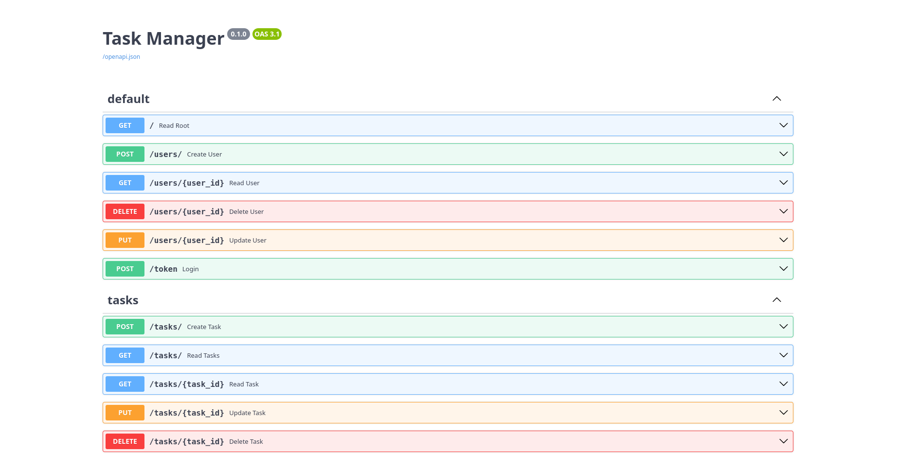

# Task Manager

Small FastAPI + SQLAlchemy app for managing tasks and users (with JWT auth).

## Quickstart

1. Clone/open the project:
   ```bash
   cd /home/lenovo/todo-task-manager-using-fast-api
   ```

2. Create and activate a virtual environment:
   ```bash
   python3 -m venv .venv
   source .venv/bin/activate
   ```

3. Install dependencies:
   ```bash
   pip install -r requirements.txt
   ```

4. Run the app:
   ```bash
   uvicorn main:app --reload --host 127.0.0.1 --port 8000
   ```

5. Open docs:
   - Swagger UI: http://127.0.0.1:8000/docs
   - ReDoc:        http://127.0.0.1:8000/redoc
   - Raw OpenAPI: http://127.0.0.1:8000/openapi.json

## Dependencies

- fastapi
- uvicorn[standard]
- sqlalchemy
- python-jose
- passlib[argon2]
- argon2-cffi
- python-multipart

A sample requirements.txt is provided in the repo.

## Auth & Swagger notes

- Token endpoint: POST /token (OAuth2 password form). In Swagger:
  1. Call POST /token with username & password to get `access_token`.
  2. Click the "Authorize" button (top-right) and paste the raw token (no `Bearer `).
  3. After authorizing, protected endpoints will send the header automatically.

- If you use curl:
  ```bash
  curl -s -X POST -F "username=you@example.com" -F "password=secret" http://127.0.0.1:8000/token
  curl -H "Authorization: Bearer <ACCESS_TOKEN>" http://127.0.0.1:8000/tasks/
  ```

## Database

- Default: SQLite file (e.g., `test.db`) in project root (check your `database.py`).
- Inspect quickly:
  ```bash
  sqlite3 test.db "SELECT id,email FROM users LIMIT 10;"
  ```
- Recommended: stop the server or open DB read-only to avoid locks.

## Routes summary

Users
- POST /users/           — create user (request: UserCreate)
- GET  /users/{user_id}  — read user
- PUT  /users/{user_id}  — update user (accepts partial updates if using optional fields)
- DELETE /users/{user_id} — delete user

Auth
- POST /token            — form login, returns access_token (JWT)

Tasks (prefix `/tasks`)
- POST /tasks/           — create task (protected)
- GET  /tasks/           — list tasks for current user (protected)
- GET  /tasks/{id}       — read single task (protected)
- PUT  /tasks/{id}       — update task (protected; partial updates supported)
- DELETE /tasks/{id}     — delete task (protected)



## Debugging & logs

- Run uvicorn with debug logs:
  ```bash
  uvicorn main:app --reload --log-level debug
  ```
- Prints and logging appear in the terminal running uvicorn (or in VS Code Debug Console if you run the app under the debugger).
- If Swagger returns "Not authenticated":
  - Ensure you used the Swagger `Authorize` and pasted the raw token.
  - Or call the endpoints with the `Authorization: Bearer <token>` header via curl.

## Notes & tips

- Password hashing uses passlib; project may be configured to use Argon2 (no 72-byte limit).
- If you add new dependencies, update `requirements.txt`:
  ```bash
  pip freeze > requirements.txt
  ```
